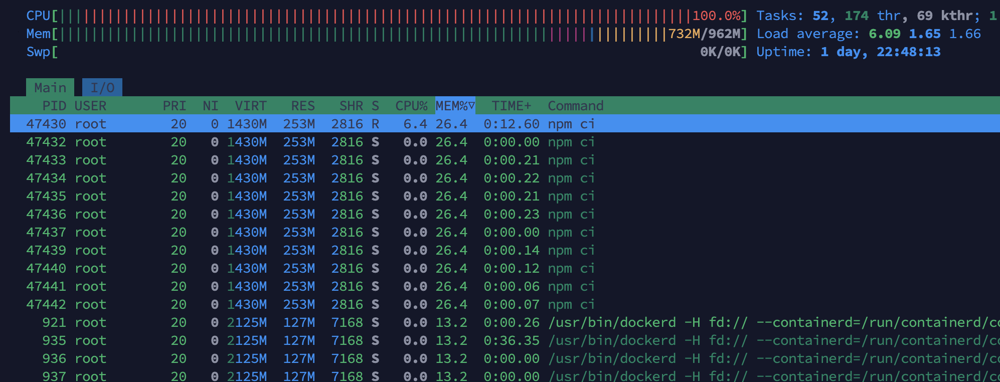

## Fuse8

`tailwind.config.ts` exists due to backward compatibility for shadcn/ui. Not it's not. Я решил все-таки остаться на последней версии tw^4, тк библиотеку базовых компонентов можно адаптировать вручную

Изначально я предполагал, что апи нужно будет писать самому, поэтому в репозитории есть папка для server части, которую я планировал писать на hono. Позже я выяснил, что апи будет внешним. Думал сгенерить доку на основе `swagger.json`, но api его не предоставляет, зато у них есть либа для создания запросов - по сути 0-deps обертки вокруг `fetch'a`, так что я просто использовал их

Мой VPS имеет серьезные ограничения памяти. Выполнение `npm ci` внутри стадии GHA приводит к переполнению RAM и завершению всего процесса. Изначально я надеялся ограничить память всей ноды через флаг `--max-old-space-size=256` командой `Run node --max-old-space-size=256 $(which npm) ci` или через env внутри GHA, но это не работало. Следующий подход - использовать ограничение для всего процесса gha `/etc/systemd/system/actions.runner.rikkaar-fuse8.fuse8-runner.service` добавлением строк

```bash
MemoryMax=512M
MemoryHigh=400M
```

Это действительно позволило сократить использование памяти процессом, но он все-ровно не смог исполнить команду `npm ci`
. В общем не так уж мне и нужен линтинг


По заданию:
1. При введении более трех символов должен отправляться запрос к API (для простоты, нужно искать только по имени, например Rick)
Всратое требование - два символа тоже валидная поисковая строка, либо на уровне дизайна нужно заложить об этом оповещение

2. Каждая карточка ведёт на страницу из поля URL элемента
Сслыка там до апишки. Какой смысл на нее уводить... Если нужна страница по персонажу, то нужен дизайн

3. Готовый код выложить либо на GitHub+GitHub Pages (ожидаем две ссылки соответственно: на репозиторий и на работающий сайт).
Ссылка на сайт закреплена на странице GitHub
